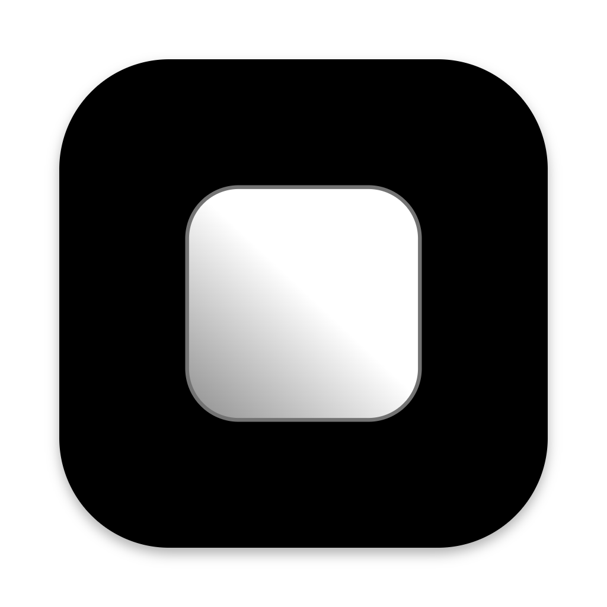

# Fluid

A desktop workspace organized around what you're working on.

- **Tasks keep work together.** Give each task its own tabs and notes, then
  settle it when you're done or reopen it later.
- **Multiple projects.** Keep separate bodies of work in one app, each with
  its own tasks and an optional local folder.
- **Spaces separate contexts.** Give work, personal projects, or different
  clients their own browsing cookies and logins.
- **Container tabs.** Use separate browser profiles to sign into multiple
  accounts on the same site within a space.
- **Ad and tracker blocking.** Block ads and known trackers with separate
  controls and per-site exceptions.
- **Split views.** See pages, terminals, files, and agents side by side.
- **Terminals alongside your work.** Run shells directly in tabs and let
  commands continue while you switch tasks.
- **VS Code tabs.** Open project folders in an embedded editor powered by
  your local VS Code installation.
- **Coding agents in context.** Work with Claude Code sessions that can read
  their task, open tabs, and leave notes.
- **Files stay with the task.** Keep documents, images, videos, and HTML
  previews beside the work they belong to.
- **Task-specific clipboard history.** Revisit text, images, and files copied
  while working in Fluid, organized by task.
- **Extensions.** Add custom tools, views, and integrations to your workspace.

## Build with Fluid

[Desktop development](packages/desktop/README.md) ·
[Extension SDK](packages/sdk/README.md)

## License

[MIT](LICENSE.md). Third-party dependencies retain their own licenses.
